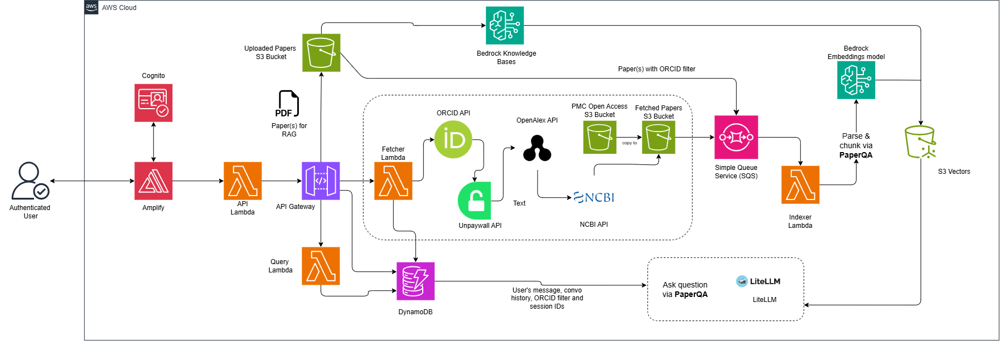

# CorpusQuery

| Index                         | Description                                         |
|:------------------------------|:----------------------------------------------------|
| [Overview](#overview)         | See what this project does and its key capabilities |
| [Demo](#demo)                 | View the demo video                                 |
| [Description](#description)   | Learn about the problem and our approach            |
| [Architecture](#architecture) | View the system architecture diagram                |
| [Tech Stack](#tech-stack)     | Technologies and services used                      |
| [Deployment](#deployment)     | How to install and deploy the solution              |
| [Usage](#usage)               | How to use the application                          |
| [Costs](#costs)               | Estimated AWS costs for running the solution        |
| [Credits](#credits)           | Meet the team behind this project                   |
| [License](#license)           | See the project's license information               |
| [Disclaimers](#disclaimers)   | Important legal disclaimers                         |

---

# Overview

**CorpusQuery** is a serverless AI-powered writing assistant designed to help senior faculty members offload the low-level, high-volume writing work that fills their days, such as grants, manuscripts, trainee letters, and letters of support. The solution uses Amazon Bedrock, PaperQA, and Claude LLMs to build a personalized knowledge base from a faculty member's own publication history, then puts that context to work through cited Q&A.

**Key capabilities include:**

- **Automated Paper Ingestion via ORCID**: Provide a researcher's ORCID and the platform automatically discovers their publication catalog via the ORCID API, then fetches available PDFs through Unpaywall, OpenAlex, and PubMed Central.
- **Manual Document Upload Option for RAG**: Upload PDFs directly to extend the knowledge base with papers not available through PubMed Central, including preprints, book chapters, or internal documents.
- **Cited Q&A over a Researcher's Corpus**: Ask natural-language questions across the indexed literature and receive answers with inline citations, powered by PaperQA's retrieve → summarize → generate pipeline.
- **Configurable LLM Settings**: Choose between Bedrock, Anthropic, or OpenAI providers and tune retrieval parameters per user via a settings panel.

---

# Demo

https://github.com/user-attachments/assets/57447efb-5168-4ca5-8423-c5459f53e847

---

# Description

## Problem Statement

Senior faculty members face an enormous volume of writing tasks (grant applications, manuscript drafts, trainee recommendation letters, and letters of support) on top of their research and teaching responsibilities. The challenge is not that machines can replace this work, but that a significant portion of it is low-level and repetitive: verifying consistency with past writing, checking that relevant prior work is cited before a draft is ready for senior review. Without tooling that understands a faculty member's own body of work, this burden falls entirely on the faculty member's time. The goal is to make the actual human faster rather than replace their judgment.

## Our Approach

### Knowledge Base Ingestion

The platform supports two ingestion paths to build a faculty member's personal knowledge base. The primary path uses a researcher's ORCID: a fetcher Lambda queries the ORCID API to discover all papers the faculty member has authored, then attempts to retrieve available PDFs through several scientific literature APIs — Unpaywall (DOI-based), OpenAlex, and finally PubMed Central (NCBI eutils + PMC Open Access S3 dataset) — and an indexer Lambda embeds and stores them in S3 Vectors with ORCID metadata for per-researcher filtering. The secondary path allows manual PDF uploads for papers not available through these APIs (preprints, book chapters, etc.) which are ingested through Amazon Bedrock Knowledge Base.

### PaperQA-Powered RAG Pipeline

The core Q&A pipeline uses [PaperQA](https://github.com/Future-House/paper-qa) to run a deterministic three-stage pipeline: retrieve relevant passages from the S3 Vectors index, summarize evidence per source using Claude, then synthesize a final cited answer grounded in the faculty member's own published work. This approach was chosen over the agentic `agent_query()` mode because PaperQA's agent expects to manage its own local index, which conflicts with the externally managed Bedrock Knowledge Base. A custom `BedrockKBVectorStore` integrates the S3 Vectors index into PaperQA's `Docs` object directly.

### Async Job Architecture

API Gateway enforces a 29-second timeout, but PaperQA queries typically take 30–60 seconds. To work around this, question submissions (`POST /ask`) immediately return a job ID, and the Query Lambda is invoked asynchronously. The frontend polls `GET /jobs/{jobId}` until the job completes. The same pattern is used for Bedrock Knowledge Base sync jobs.

### React Frontend on Amplify

The frontend is a React 19 + TypeScript SPA built with Vite and styled with TailwindCSS. It is hosted on AWS Amplify and communicates with the backend via a Cognito-authenticated REST API. Key panels include Chat (Q&A with session history), Documents (upload and sync), and Settings (model and retrieval configuration).

## Testing & Validation

PaperQA retrieval settings were empirically tuned across 27 test runs using five representative manuscript test cases (factual recall, quantitative extraction, mechanism synthesis, methodology verification, and cross-dataset synthesis).

| Setting | Finding | Selected Value |
|:--------|:--------|:---------------|
| `answer_length` | Most impactful — 400 words yielded +46% improvement over 200 words | `400 words` |
| `evidence_k` + `answer_max_sources` | 20/10 improved scores by 38% | `20` / `10` |
| `mmr_lambda` | 0.7 (30% diversity) improved synthesis questions by +62.5% | `0.7` |
| `evidence_relevance_score_cutoff` | **Critical** — any value >1 causes catastrophic failure with Bedrock KB (scores collapsed from 30% to 5%) | `1` (must not exceed) |

Best configuration achieved a 37.5% average score across all test cases. Settings contributed ~46% improvement; prompt structure (KEY FINDING / DATA / METHODS / CAVEATS format) added a further +15–25%.

---

# Architecture



---

# Tech Stack

| Category | Technology | Purpose |
|:---------|:-----------|:--------|
| **Amazon Web Services** | [AWS Lambda](https://aws.amazon.com/lambda/) | Serverless compute for API, query, fetcher, and indexer functions |
| | [Amazon API Gateway](https://aws.amazon.com/api-gateway/) | REST API with Cognito authorizer; routes requests to API Lambda |
| | [Amazon Bedrock](https://aws.amazon.com/bedrock/) | Claude LLMs for answer generation; Titan Embed v2 for embeddings; Knowledge Base for PDF ingestion |
| | [Amazon S3](https://aws.amazon.com/s3/) | Storage for uploaded PDFs and fetched papers |
| | [Amazon S3 Vectors](https://aws.amazon.com/s3/features/vectors/) | Vector index (cosine, 1024-dim) for semantic retrieval with per-researcher ORCID filtering |
| | [Amazon DynamoDB](https://aws.amazon.com/dynamodb/) | Stores sessions, chat history, and job records |
| | [Amazon Cognito](https://aws.amazon.com/cognito/) | User authentication; admin-provisioned accounts with ID token auth |
| | [AWS Amplify](https://aws.amazon.com/amplify/) | Hosts and deploys the React SPA |
| | [AWS SSM Parameter Store](https://aws.amazon.com/systems-manager/features/#Parameter_Store) | Stores per-user LLM and retrieval settings |
| | [AWS Secrets Manager](https://aws.amazon.com/secrets-manager/) | Stores user-provided Anthropic and OpenAI API keys |
| | [AWS CDK](https://aws.amazon.com/cdk/) | Infrastructure as code (TypeScript) for all AWS resources |
| **Backend** | [Python 3.12](https://www.python.org/) | Backend runtime for all Lambda functions |
| | [PaperQA](https://github.com/Future-House/paper-qa)<sup>1</sup> | Core RAG framework: retrieve → summarize → generate with citations |
| | [LiteLLM](https://github.com/BerriAI/litellm) | LLM provider abstraction (Bedrock, Anthropic, OpenAI) |
| | [boto3](https://boto3.amazonaws.com/v1/documentation/api/latest/index.html) / [aioboto3](https://github.com/terrycain/aioboto3) | AWS SDK (sync and async) |
| | [aws-lambda-powertools](https://docs.powertools.aws.dev/lambda/python/) | Lambda logging, tracing, and event routing |
| | [uv](https://docs.astral.sh/uv/) | Python workspace and package manager |
| **External APIs** | [ORCID Public API](https://pub.orcid.org/) | Discovers a researcher's works and retrieves DOIs from their ORCID profile |
| | [Unpaywall](https://unpaywall.org/products/api) | Resolves DOIs to open-access PDF URLs |
| | [OpenAlex](https://openalex.org/) | Fallback PDF retrieval by title and ORCID filter |
| | [NCBI E-utilities](https://www.ncbi.nlm.nih.gov/home/develop/api/) + [PMC Open Access](https://www.ncbi.nlm.nih.gov/pmc/tools/openftlist/) | Final fallback — searches PubMed Central and copies files from the PMC OA S3 dataset |
| **Frontend** | [React 19](https://react.dev/) + [TypeScript](https://www.typescriptlang.org/) | UI framework and type safety |
| | [Vite](https://vite.dev/) | Frontend build tool |
| | [TailwindCSS](https://tailwindcss.com/) | Utility-first styling |
| | [Framer Motion](https://motion.dev/) | UI animations |
| | [TanStack Query](https://tanstack.com/query) | Server state management and API call caching |
| | [aws-amplify](https://docs.amplify.aws/) | Cognito auth integration and authenticated fetch |
| | [Bun](https://bun.sh/) | JavaScript runtime and package manager |


> <sup>1</sup> Skarlinski, M. D., Cox, S., Laurent, J. M., Braza, J. D., Hinks, M., Hammerling, M. J., Ponnapati, M., Rodriques, S. G., & White, A. D. (2024). Language agents achieve superhuman synthesis of scientific knowledge. preprint. https://doi.org/10.48550/arXiv.2409.13740


---

# Deployment

## Prerequisites

1. An [AWS account](https://signin.aws.amazon.com/signup?request_type=register) with permissions for: CloudFormation, Lambda, S3, DynamoDB, Cognito, API Gateway, Bedrock, S3 Vectors, SSM, Secrets Manager, and Amplify
2. **Python 3.12+** — [Download here](https://www.python.org/downloads/)
3. **Node.js 18+** — [Download here](https://nodejs.org/en/download)
4. **uv** (Python package manager) — [Installation guide](https://docs.astral.sh/uv/getting-started/installation/)
5. **Bun** (JavaScript runtime) — [Installation guide](https://bun.sh/docs/installation)
6. **AWS CLI v2** — [Installation guide](https://docs.aws.amazon.com/cli/latest/userguide/getting-started-install.html)
7. **Docker** (for Lambda bundling during CDK deploy) — [Download here](https://docs.docker.com/get-started/get-docker/)

> **Windows users:** WSL (Windows Subsystem for Linux) is recommended. The deployment scripts (`scripts/*.sh`) are bash-based. Windows users without WSL will need to run equivalent commands manually — see the manual steps in each section below.

## AWS Configuration

**Configure AWS credentials:**
```bash
aws configure
# Or set environment variables:
# export AWS_ACCESS_KEY_ID=...
# export AWS_SECRET_ACCESS_KEY=...
# export AWS_REGION=us-east-1
```

**Bootstrap CDK** *(required once per AWS account/region):*
```bash
cd cdk
bun install
bun run cdk bootstrap
```

## Backend Deployment

**1. (Optional) Set environment variables:**
```bash
export ALLOW_LOCALHOST=true  # Enable CORS for localhost:5173 during development
export LOG_LEVEL=DEBUG       # Lambda log level (default: INFO)
```

**2. Deploy the CDK stack:**
```bash
cd cdk
bun run cdk deploy
```

**3. Note the stack outputs** — you'll need these for frontend configuration:
```
Outputs:
CorpusQueryStack.ApiUrl            = https://xxxxxxxxxx.execute-api.us-east-1.amazonaws.com/prod/
CorpusQueryStack.UserPoolId        = us-east-1_xxxxxxxxx
CorpusQueryStack.UserPoolClientId  = xxxxxxxxxxxxxxxxxxxxxxxxxx
CorpusQueryStack.AmplifyAppId      = xxxxxxxxxx
CorpusQueryStack.AmplifyAppUrl     = https://main.xxxxxxxxxx.amplifyapp.com
```

**4. Create a Cognito user** (self-signup is disabled — all users must be admin-created):
```bash
aws cognito-idp admin-create-user \
  --user-pool-id <UserPoolId> \
  --username user@example.com \
  --user-attributes Name=email,Value=user@example.com Name=given_name,Value=First Name=family_name,Value=Last \
  --temporary-password "TempPass123!"
```

## Frontend Deployment

**macOS/Linux:**
```bash
# Make Scripts executabe (Mac/Linux/Git Bash on Windows)
chmod +x scripts/deploy-frontend.sh


./scripts/deploy-frontend.sh
```

The script automatically fetches CDK stack outputs, builds the frontend with production environment variables, creates an Amplify deployment job, uploads the build artifact, and waits for deployment to complete.

<details>
<summary><strong>Windows (without WSL) — manual deployment</strong></summary>

**1. Create `frontend/.env.production`:**
```
VITE_API_URL=https://xxxxxxxxxx.execute-api.us-east-1.amazonaws.com/prod/
VITE_USER_POOL_ID=us-east-1_xxxxxxxxx
VITE_USER_POOL_CLIENT_ID=xxxxxxxxxxxxxxxxxxxxxxxxxx
VITE_AWS_REGION=us-east-1
```

**2. Build the frontend:**
```powershell
cd frontend
bun run build
```

**3. Create deployment and get upload URL:**
```powershell
aws amplify create-deployment --app-id <AmplifyAppId> --branch-name main
```

Note the `zipUploadUrl` and `jobId` from the response.

**4. Zip the dist folder:**
```powershell
cd frontend/dist
Compress-Archive -Path * -DestinationPath deploy.zip
```

**5. Upload to Amplify:**
```powershell
Invoke-WebRequest -Uri "<zipUploadUrl>" -Method PUT -InFile deploy.zip -ContentType "application/zip"
```

**6. Start deployment:**
```powershell
aws amplify start-deployment --app-id <AmplifyAppId> --branch-name main --job-id <jobId>
```

</details>

## Local Development

**Backend:**
```bash
cd backend
uv sync --all-packages
uv run pytest
```

**Frontend:**
```bash
# Make script executable
chmod +x scripts/create-env-local.sh

# Generate .env.local from CDK outputs (macOS/Linux):
./scripts/create-env-local.sh

# Or manually create frontend/.env.local with values from cdk deploy output.

cd frontend
bun install
bun dev
# App available at http://localhost:5173
```

---

# Usage

1. **Access the Application** — After deployment, the frontend URL is in the CDK output as `CorpusQueryStack.AmplifyAppUrl`.

2. **Log In** — Sign in with the Cognito credentials created during deployment. You will be prompted to set a new password on first login.

3. **Ingest Papers** — Navigate to the **Documents** panel. You can either:
   - Upload PDFs directly via the upload interface (files are stored in S3 and indexed by Bedrock Knowledge Base), or
   - Enter a researcher's **ORCID** to automatically fetch and ingest their available papers via Unpaywall, OpenAlex, and PubMed Central.

   After uploading, trigger a Knowledge Base sync if needed using the **Sync** button.

4. **Ask Questions** — Navigate to the **Chat** panel. Type a natural-language question about the indexed papers. Optionally select an ORCID to scope your query to a specific researcher's papers. The app submits the job and polls for results — answers include inline citations linked to downloadable source documents.

5. **Configure Settings** — Navigate to the **Settings** panel to choose your LLM provider (Bedrock, Anthropic, or OpenAI), select a model, and adjust retrieval parameters. If using a non-Bedrock provider, enter your API key in the API Keys section.

---

# Costs

## Estimated Monthly Recurring Costs

| Service | Estimated Cost | Notes |
|:--------|---------------:|:-------|
| AWS Lambda | ~$0 | Free tier covers typical prototype usage |
| Amazon DynamoDB | ~$0 - <$1 | Free tier ($0); On-demand: $0.25/GB-month for storage, $0.625/1M WRUs, $0.125/1M RRUs  |
| Amazon S3 | <$1 | Depends on number of papers stored |
| Amazon S3 Vectors Storage | <$1 | $0.06/GB |
| Amazon S3 Vectors Requests | <$1 | $0.20/GB for PUT requests |
| Amazon S3 Vectors Query | <$1 | $0.0025/1K requests |
| Amazon Cognito | ~$0 | Free tier: 10,000 MAUs/month |
| Amazon API Gateway | ~$0 | Free tier: 1M requests/month |
| AWS Amplify Hosting | ~$0 | Free tier covers typical prototype traffic |
| **Total Baseline** | **~$1–3/month** | Excluding Bedrock LLM and embedding usage |

## Per-Query Costs

Costs vary depending on the selected model and query complexity. Example for a typical PaperQA query using Claude Sonnet on Bedrock:

| Component | Usage | Approximate Cost |
|:----------|:-----:|----------------:|
| Titan Embed v2 (retrieval) | ~20 chunks × 512 tokens | $0.0002 |
| Claude Sonnet (summarize + generate) | ~8,000 input / ~600 output tokens | $3/1M tokens (Sonnet 4.6) x 8600 tokens = ~$0.03 |
| **Total per query** | | **~$0.03** |

| Monthly Usage | Estimated Cost |
|:--------------|---------------:|
| 100 queries | ~$3 |
| 500 queries | ~$15 |
| 1,000 queries | ~$30 |

> **Note:** Cost estimates are based on AWS pricing as of July 2026. Actual costs depend on model selection, paper corpus size, and query volume.


---

# Credits

**CorpusQuery** is an open-source project developed by the Pitt Cloud Innovation Center, Powered by AWS.

**Development Team:**

- [Angela Renion](https://www.linkedin.com/in/angela-renion/)
- [Misran Mohammed](https://www.linkedin.com/in/mmisran/)
- [Ava Luu](https://www.linkedin.com/in/avaluu/)


**Project Leadership:**

- **Technical Lead**: [Maciej Zukowski](https://www.linkedin.com/in/maciejzukowski/) - Solutions Architect, Amazon Web Services (AWS)
- **Marketing Lead**: [Kate Ulreich](https://www.linkedin.com/in/kate-ulreich-0a8902134/) - Lead, Digital Marketing Strategy, Pitt Digital
- **Program Manager**: [Dwight Helfrich](https://www.linkedin.com/in/dwight-helfrich-53a233b/) - Program Leader, Pitt Cloud Innovation Center, Powered by AWS

**Special Thanks:**
- [Alexander Chang](https://www.linkedin.com/in/alexander-chang-839a53a6/) - MD-PhD Student at University of Pittsburgh School of Medicine


> This project is designed and developed with guidance and support from
> the [Pitt Cloud Innovation Center, Powered by AWS](https://digital.pitt.edu/cic).
---

# License

This project is licensed under the [MIT License](./LICENSE).

```plaintext
MIT License

Copyright (c) 2026 Pitt Cloud Innovation Center, Powered by AWS

Permission is hereby granted, free of charge, to any person obtaining a copy
of this software and associated documentation files (the "Software"), to deal
in the Software without restriction, including without limitation the rights
to use, copy, modify, merge, publish, distribute, sublicense, and/or sell
copies of the Software, and to permit persons to whom the Software is
furnished to do so, subject to the following conditions:

The above copyright notice and this permission notice shall be included in all
copies or substantial portions of the Software.

THE SOFTWARE IS PROVIDED "AS IS", WITHOUT WARRANTY OF ANY KIND, EXPRESS OR
IMPLIED, INCLUDING BUT NOT LIMITED TO THE WARRANTIES OF MERCHANTABILITY,
FITNESS FOR A PARTICULAR PURPOSE AND NONINFRINGEMENT. IN NO EVENT SHALL THE
AUTHORS OR COPYRIGHT HOLDERS BE LIABLE FOR ANY CLAIM, DAMAGES OR OTHER
LIABILITY, WHETHER IN AN ACTION OF CONTRACT, TORT OR OTHERWISE, ARISING FROM,
OUT OF OR IN CONNECTION WITH THE SOFTWARE OR THE USE OR OTHER DEALINGS IN THE
SOFTWARE.
```

---

For questions, issues, or contributions, please visit our [GitHub repository](https://github.com/pitt-cic/CorpusQuery) or contact the development team.

---

# Disclaimers

**Customers are responsible for making their own independent assessment of the information in this document.**

**This document:**  
(a) is for informational purposes only,  
(b) references AWS product offerings and practices, which are subject to change without notice,  
(c) does not create any commitments or assurances from AWS and its affiliates, suppliers or licensors. AWS products or services are provided "as is" without warranties, representations, or conditions of any kind, whether express or implied. The responsibilities and liabilities of AWS to its customers are controlled by AWS agreements, and this document is not part of, nor does it modify, any agreement between AWS and its customers, and  
(d) is not to be considered a recommendation or viewpoint of AWS.

**Additionally, you are solely responsible for testing, security and optimizing all code and assets on GitHub repo, and all such code and assets should be considered:**  
(a) as-is and without warranties or representations of any kind,  
(b) not suitable for production environments, or on production or other critical data, and  
(c) to include shortcuts in order to support rapid prototyping such as, but not limited to, relaxed authentication and authorization and a lack of strict adherence to security best practices.

**All work produced is open source. More information can be found in the GitHub repo.**
